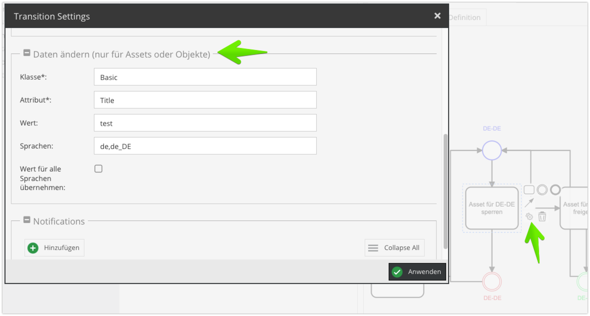
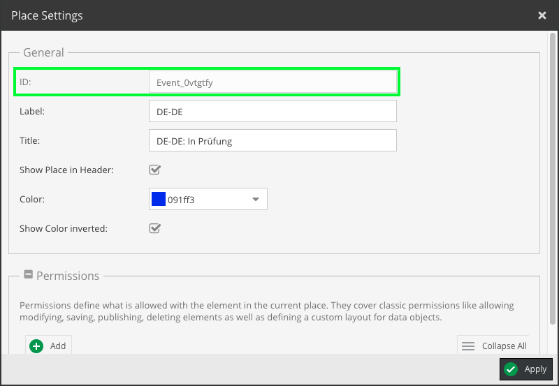

# Studio1® Pimcore Workflow Extend Bundle

This bundle extends the Pimcore Workflow Feature. It adds the possibility to change data during the workflow transition.

> **Warning:** This bundle is completely untested with the Pimcore communitiy edition and will probably not work.
> Further work is needed to make it work with the community edition.

## Dependencies

Will be automatically installed with composer:

- [Pimcore Enterprise Asset Metadata Bundle](https://pimcore.com/docs/asset-metadata/current/)
- [Pimcore Workflow Designer](https://pimcore.com/docs/workflow-designer/current/)
- [Composer Patches](https://github.com/cweagans/composer-patches)

## Installation

### Preparation

Before you require the bundle via composer, you need to add the following to your composer.json:

```json
  "extra": {
    "enable-patching": true
  }
```

This will enable the composer patches plugin, for external dependencies.

### Composer

```bash
composer require studio1/workflow-extend:[version]
```

During the installation process, the composer patches plugin will automatically apply the 
needed patches to the pimcore core files.

Please check if the patches were applied correctly. If not, you need to remove the vendor folder and run `composer install` again.

### Enable Bundle

Enable the bundle as with any other Pimcore bundle.

```bash
bin/console pimcore:bundle:enable WorkflowExtendBundle
```

### Uninstall

```bash
composer remove studio1/workflow-extend
```
> Please note that the composer patches plugin will not remove the patches automatically. You need to remove them manually.

## Usage / Configuration

> **Warning:** The bundle currently supports data objects and assets only (no documents etc.).

| Configuration   | Explanation                                                                                                                                                           |
|-----------------|-----------------------------------------------------------------------------------------------------------------------------------------------------------------------|
| class           | MAM- or PIM Class                                                                                                                                                     |
| attribute       | Attribute that will be changed during the transition                                                                                                                  |
| value           | Value that will be set on the given object/attribute                                                                                                                  |
| languages       | Languages for which the value should be set. Comma separated e.g. (de,de_DE,en,en_US). Not needed, if localized fields are not available or `languagesSetAll` is set. |
| languagesSetAll | The value will be applied for all available languages                                                                                                                 |

For Pimcore Enterprise Projects, you can configure the workflow transitions in the backend:



In Pimcore Community Edition, you need to populate the `data` option (implemnted by this bundle) in your workflow
configuration:

```yaml
  transitions:
    example-transition:
      options:
        label: 'Example transition'
        # ...
        # data that will be changed during the transition
        data:
          class: Basic
          attribute: Title
          value: test
          languages: 'de,de_DE'
          languagesSetAll: true
```

## Logs

Can be found in `var/log/workflow-extend-bundle.log`.

## Main components

- [transitionSettings.js](src/Resources/public/js/pimcore/configuration/item/transitionSettings.js)
    - Extends the Pimcore Workflow Designer by additional fields for the transition settings popup
- [SetAttributeSubscriber.php](src/EventSubscriber/SetAttributeSubscriber.php)
    - Listens to the `workflow.transition` event and changes the data
- [addDiConfiguration.patch](patches/addDiConfiguration.patch)
    - Adds the `data` option to the workflow configuration
    - A patch file is needed, since there is no other way to extend the dependency injection configuration of the
      workflow bundle
- [addIDPlaceSettings.patch](patches/addIDPlaceSettings.patch)
    - Adds the `id` field to the state configuration
    - A patch file is needed, since there is no other way to extend the place settings of the
      workflow bundle
    - 

---

Last modified: 2023-04-04